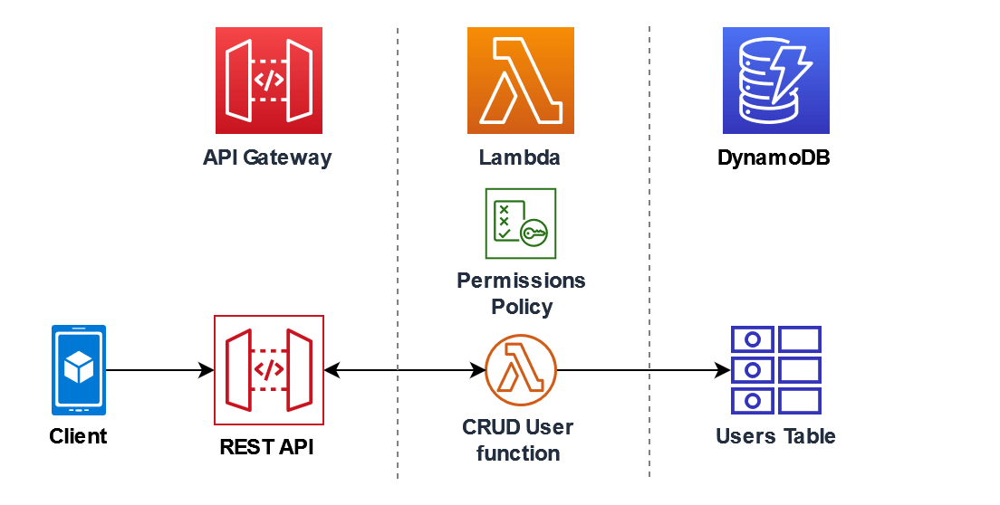

# Product API Using AWS Lambda and API Gateway

This is a sample project to demonstrate how to build a REST API using AWS Lambda and API Gateway.

## Structure



## Prerequisites

* [AWS CLI](https://aws.amazon.com/cli/)
* [AWS Console Account](https://aws.amazon.com/console/)
* [Python 3.9](https://www.python.org/downloads/)
* [AWS Lambda](https://aws.amazon.com/lambda/)
* [AWS API Gateway](https://aws.amazon.com/api-gateway/)
* [AWS IAM](https://aws.amazon.com/iam/)
* [AWS CloudWatch](https://aws.amazon.com/cloudwatch/)
* [AWS DynamoDB](https://aws.amazon.com/dynamodb/)

## Setup

*Note:* Assuming you have already created an AWS account and have the AWS CLI installed and configured.

### Create IAM Policy and Role

Create an IAM policy with the following permissions:

```json
{
  "Version": "2012-10-17",
  "Statement": [
    {
      "Sid": "Stmt1428341300017",
      "Action": [
        "dynamodb:GetItem",
        "dynamodb:PutItem",
        "dynamodb:Scan"
      ],
      "Effect": "Allow",
      "Resource": "*"
    },
    {
      "Sid": "",
      "Resource": "*",
      "Action": [
        "logs:CreateLogGroup",
        "logs:CreateLogStream",
        "logs:PutLogEvents"
      ],
      "Effect": "Allow"
    }
  ]
}
```

Create an IAM role for AWS Service - Lambda with the above policy attached.

### Create DynamoDB Table

Create a DynamoDB table with the following properties:

* Table name: `products`
* Primary partition key: `id` (String)
* Fields: `id`, `name`, `description`

### Create Lambda Function

Create a Lambda function as described in the file `LambdaFunctionOverHttps.py` in this repository.
The `handler` works as the entry point for the Lambda function and takes the following parameters:

* `event`: The event data passed to the Lambda function which should contain the operation to be performed and the payload.
* `context`: The runtime information of the Lambda function.

The following operations are supported:

* `get`: Get a product by ID
* `create`: Create a new product
* `getAll`: Get all products
* `echo`: Return the event data [for testing purposes]

Here are the inputs for each operation:

* `get`: `{"operation": "get", "payload": {"id": "1"}}`
* `create`: `{"operation": "create", "payload": "Item": {{"id": "1", "name": "Product 1", "description": "Description of Product 1"}}}`
* `getAll`: `{"operation": "getAll", "payload": {}}`

To publish the Lambda function, run the following command:

```bash
zip function.zip LambdaFunctionOverHttps.py
aws lambda create-function --function-name LambdaFunctionOverHttps --zip-file fileb://function.zip --handler LambdaFunctionOverHttps.handler --runtime python3.9 --role <role-arn>
```

### Create API Gateway

Create an API Gateway with the following properties:

* Resource name: `DynamoDBManager`
* Resource path: `/DynamoDBManager`
* Method: `POST`
* API Key required: `true`

**Note**: For API Key creation, need to attach a usage plan to the API Gateway.

### Add CloudWatch Logs

Add CloudWatch logs to the Lambda function to log the events. The logs can be viewed in the CloudWatch console.

### Test the API

Test the API using POSTMAN at the following URL with POST method:

```bash
https://v8u02y61t5.execute-api.us-east-2.amazonaws.com/test/DynamoDBManager
```

Headers must contain:

```json
{
    'x-api-key': '<api-key>'
}
```

And the body must contain the operation and payload as described above.


### References

* [API Gateway Tuturial](https://docs.aws.amazon.com/lambda/latest/dg/services-apigateway-tutorial.html)
* [Using API Keys for REST API](https://medium.com/@fengliplatform/use-api-key-to-protect-your-rest-api-in-aws-api-gateway-1578f14b7db9)
* [Choose an API Key source](https://docs.aws.amazon.com/apigateway/latest/developerguide/api-gateway-api-key-source.html)
